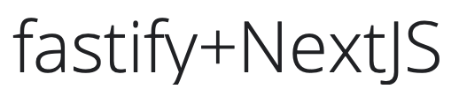

  
  <h1>fastify-nextjs-project</h1>
  <h4 align="center">🐅 Project template to build a Fastify + NextJS application</h4>

# Contributing

Every kind of contribution to this project is welcome, please, don't hesitate
to open a Pull Request or Issue. I will be happy to help!
